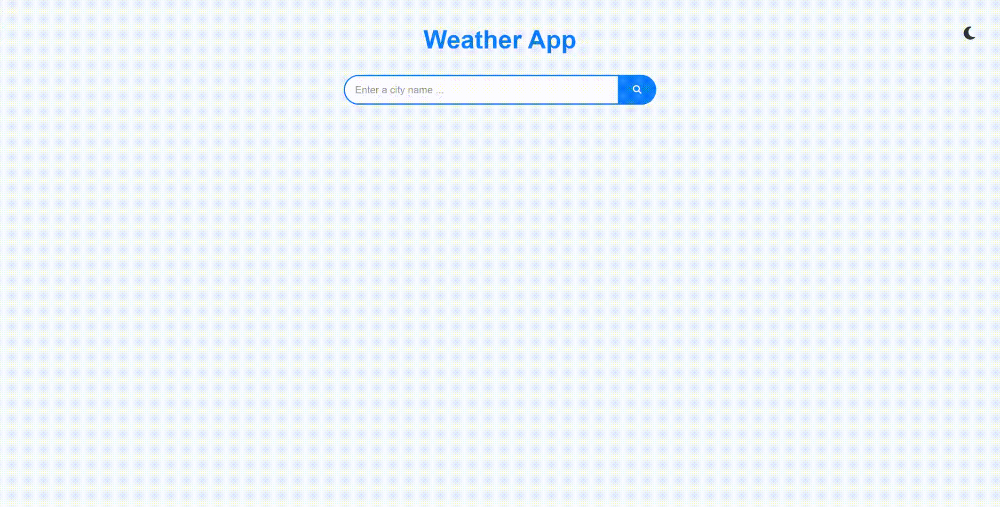

## Weather App

A simple and stylish weather application where you can search for a city and see the current weather conditions.

## 🚀 Features

🌍 Search for any city and get real-time weather data

📅 Displays current date

🌡️ Shows temperature, feels like temperature, humidity, pressure, and wind speed

🎨 Light and dark theme toggle

🔄 Loader animation during data fetching

⚠️ Error message for invalid city names

## 🛠️ Technologies Used

- **HTML**: The structural components of the app. 🏗️
- **CSS**: The visual design and styling of the app. 🎨
- **SCSS**: SCSS is used for advanced styling and organization. 🖌️
- **JavaScript**: JavaScript powers the dynamic functionality of the app. 🖥️
- **API Integration**: OpenWeatherMap API. 📊

## 📱 Responsive Design

The Weather App is fully responsive and provides an excellent experience across all devices.

## 🔍 Preview

